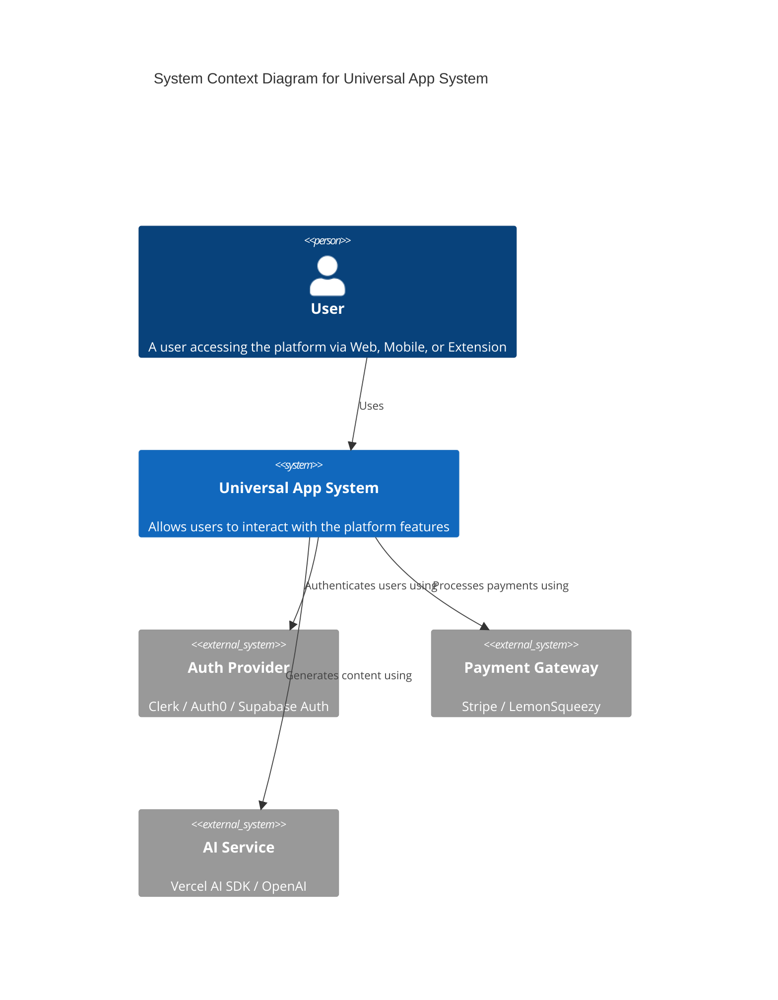
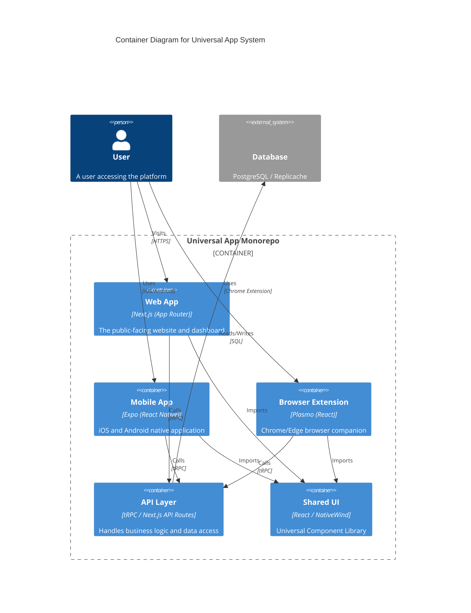
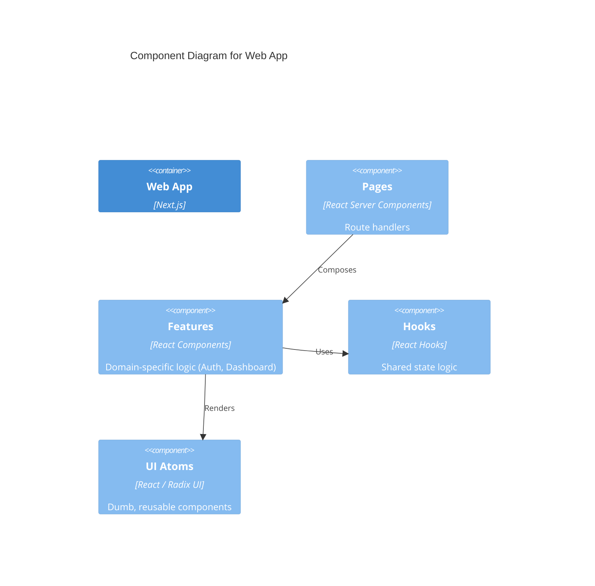

# C4 Architecture Model

## Level 1: System Context
**The Big Picture**: How the Universal App fits into the world.

## Level 2: Container Diagram
**The High-Level Tech**: The deployable units.

## Level 3: Component Diagram (Web App)
**The Internals**: How the Web App is structured.

